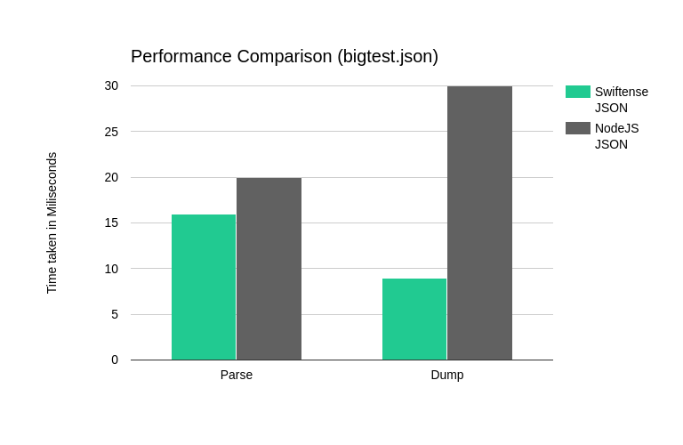

<h1>Swiftense Utility Library</h1>
A basic utility Library that is used across the Project and contains a variety of different Algorithms.
Was written mostly for educational purposes is not up to industry standards.
<h2>List</h2>
<ul>
<li><strong>Text Parser</strong> (Utils/StringIterator/StringIterator.h)</li>
<li><strong>Json Parser</strong> (Utils/StringIterator/StringIterator.h)</li>
<li><strong>Hashmap Algorithm</strong> (Utils/SHashmap.h)</li>
<li><strike><strong>Quick Search Tree Algorithm</strong> (Utils/SQTree.h)</strike> removed due to performance overhead compared to hashmap algorithm</li>
<li><strong>Database backend</strong> (Utils/SQTree/NMap.h, Utils/SQTree/SQTree.h)</li>
<li><strong>Dynamic String Utility</strong> (Utils/String/String.h)</li>
<li><strong>Number Conversion & Base64 Utility</strong> (Utils/String/Convert.h)</li>
<li><strong>Vector Utility</strong> (Utils/Vector.h)</li>
</ul>

<h1>Json Parser</h1>
<h2>Performance</h2>

Read/Write Performance test on 100K lines of json data

<h2>Usage</h2>
<ul>
<li>1.) Create Iterator using <strong>itr_loadFromLargeFile</strong> Function</li>
<li>2.) Parse Data using <strong>itr_getAbstract</strong> Function</li>
<li>3.) Modify Data</li>
<li>4.) Dump or Stringify updated Data using <strong>itr_dump</strong> or <strong>itr_stringify</strong> Functions</li>
</ul>

<h1>Database Backend</h1>
A semi-complete database backend using mmap system call to map a file/device to memory which can be accessed via the nmap memory allocator and allows to create persistent memory pages bound to a file/device. This allows fast implementation of datastructures.
<h2>Usage</h2>
Use <code>nmap_openStorage</code>, <code>nmap_closeStorage</code>, <code>nmap_openStorageOnDevice</code> in combination with the nmap allocator functions <code>nmap_alloc</code>, <code>nmap_free</code>, <code>nmap_seek</code>, <code>nmap_realloc</code>, <code>nmap_optainDbDir</code> to manage the persistent memory. In the <strong>SQTree.h</strong> a datastructure, using the system can be found. An Interface for the backend utilizing the performance benefits is not planned, the allocator is used in persistent types of the Swiftense Scripting Language.
<h2>Note</h2>
The System doesn't keep track of the space remaining on the partition, so if you dont have any left it will just instantly crash with something called "Bus error".
<h1>License</h1>

This work is licensed under <a href="http://creativecommons.org/licenses/by-nc-nd/4.0/?ref=chooser-v1" target="_blank" rel="license noopener noreferrer" style="display:inline-block;">Attribution-NonCommercial-NoDerivatives 4.0 International</a>

